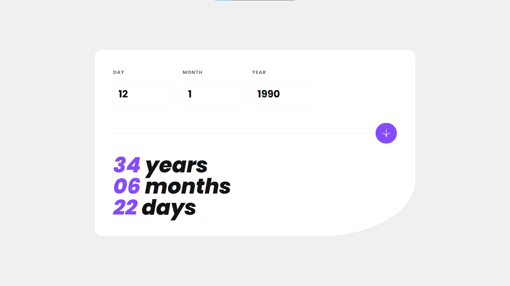

# Frontend Mentor - Age calculator app solution

This is a solution to the [Age calculator app challenge on Frontend Mentor](https://www.frontendmentor.io/challenges/age-calculator-app-dF9DFFpj-Q). Frontend Mentor challenges help you improve your coding skills by building realistic projects.

## Table of contents

- [Overview](#overview)
  - [The challenge](#the-challenge)
  - [Screenshot](#screenshot)
  - [Links](#links)
- [My process](#my-process)
  - [Built with](#built-with)
  - [What I learned](#what-i-learned)
  - [Continued development](#continued-development)
- [Author](#author)

## Overview

### The challenge

Users should be able to:

- View an age in years, months, and days after submitting a valid date through the form
- Receive validation errors if:
  - Any field is empty when the form is submitted
  - The day number is not between 1-31
  - The month number is not between 1-12
  - The year is in the future
  - The date is invalid e.g. 31/04/1991 (there are 30 days in April)
- View the optimal layout for the interface depending on their device's screen size
- See hover and focus states for all interactive elements on the page

### Screenshot

### Links

- Solution URL: [Github](https://github.com/medaich/age-calculator)
- Live Site URL: [Vercel](https://age-calculator.vercel.app/)

## My process

### Built with

- Semantic HTML5 markup
- Flexbox
- Mobile-first workflow
- [Tailwind](https://tailwindcss.com/) - css utility first framework
- [React](https://reactjs.org/) - JS library
- [React hook form](https://react-hook-form.com/) - React library

### What I learned

I've learned some Tailwind utilities to simplify the life styling my components. And also I've practiced working with forms and handling errors using React Hook Form

### Continued development

I'd like to continue improving my styling capabilities and my React skills building a lot of projects experimenting its powerful ecosystem using React Tanstack (React Query) for remote state, useReducer, context API, Redux and Redux Toolkit for global state, and also React Patterns such as Compound Component, HOC and render prop. After building powerful projects with React Nextjs would be the next station.

## Author

- Frontend Mentor - [@medaich](https://www.frontendmentor.io/profile/medaich)
- Twitter - [@medaichx](https://www.twitter.com/medaichx)
